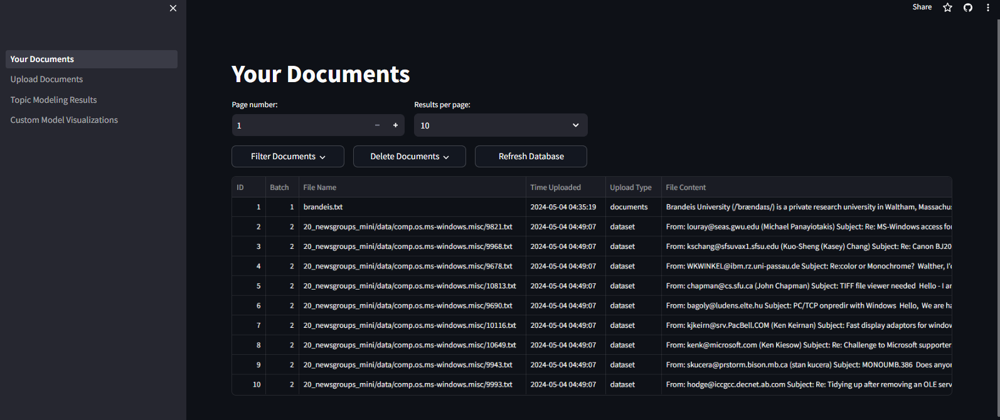
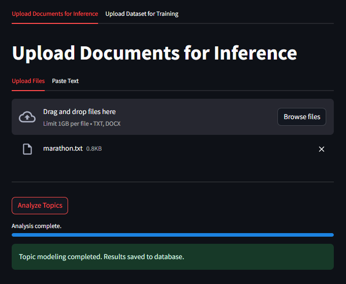
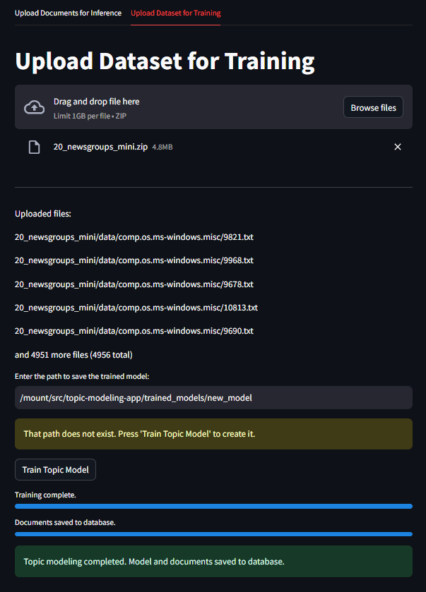
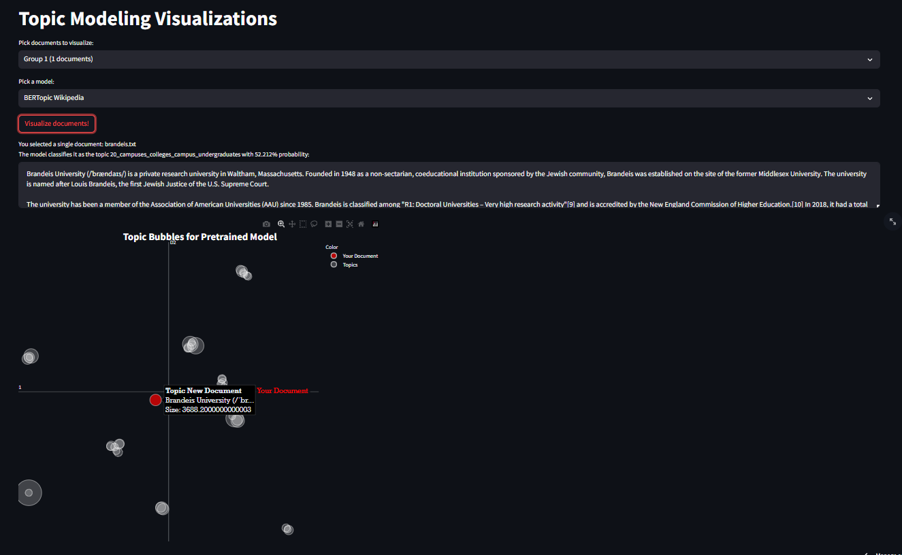
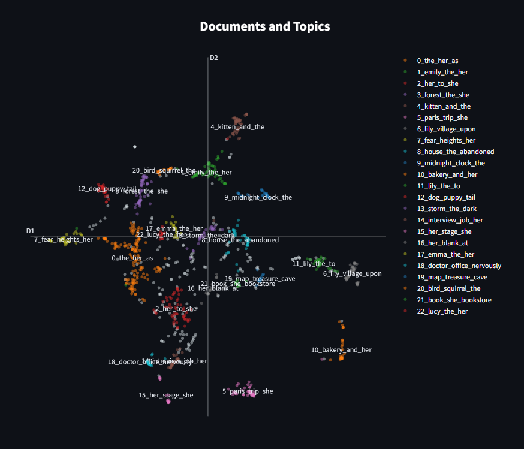
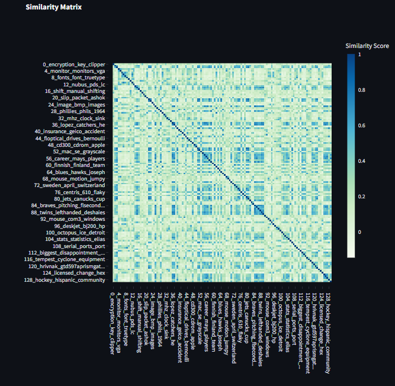
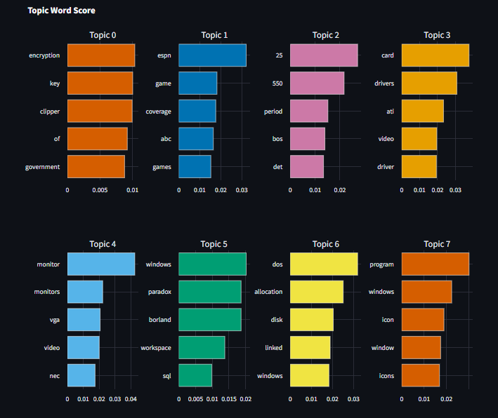

# EasyTopics

A web app to detect, analyze and visualize topics from your documents using BERTopic.
[**Link to app**](https://easytopics.streamlit.app/)

## Table of contents: 

  * [App overview](#app-overview)
    + [Homepage](#homepage)
    + [Upload Documents page](#upload-documents-page)
    + [Topic Modeling Results page](#topic-modeling-results-page)
  * [Running the app](#running-the-app)
    + [Option 1 (recommended): Docker](#option-1--recommended---docker)
    + [Option 2: Running from source code](#option-2--running-from-source-code)
  * [Running unit tests](#running-unit-tests)

<small><i><a href='http://ecotrust-canada.github.io/markdown-toc/'>Table of contents generated with markdown-toc</a></i></small>

## App overview

### Homepage

This page shows all the documents you have uploaded, classified into two upload types: documents (for individual file uploads), and dataset (for zip uploads). 

You can filter and delete documents by various criteria.



### Upload Documents page

You can either: 

1. Upload a single document and run a pretrained topic model on it ([BERTopic Wikipedia](https://huggingface.co/MaartenGr/BERTopic_Wikipedia) in this case):




2. Upload a dataset in the form of a zip folder and train a topic model. Note: this may take a while depending on the size of your dataset.



### Topic Modeling Results page 

On this page, you are given the option to visualize topic modeling results on document uploads or dataset uploads, using either the pretrained BERTopic Wikipedia model, or your own model.



### Custom Model Visualizations page 

You can also view different topic visualizations of your trained model: 







## Running the app

### Option 1 (recommended): Docker

1. Building the image: 
```
docker build -t topic-modeling-app .
```

2. Running the app: 
```
 docker run -p 8501:8501 topic-modeling-app
```
Navigate to http://localhost:8501 to access app.

### Option 2: Running from source code

1. Setup virutal environment:
```
conda create -n topic-modeling-app python=3.11
conda activate topic-modeling-app
python -m pip install -r requirements.txt
```

2. `cd` into app directory and run the streamlit app:
```
python -m streamlit run 1_Your_Documents.py
```

## Running unit tests

`cd` into app directory:

```
python -m unittest discover -s unit_tests
```
